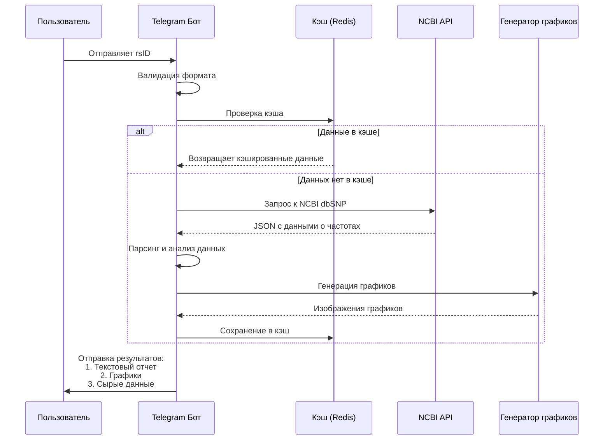

# **Telegram-бот для анализа частот генотипов**

## **1. Общие положения**

### 1.1. Наименование проекта
**SNP-Frequency-Bot** - Telegram-бот для получения и визуализации частот генотипов по rsID из внешей базы данных. Например,  NCBI

https://api.ncbi.nlm.nih.gov/variation/v0/refsnp/{rsid_number}

https://eutils.ncbi.nlm.nih.gov/entrez/eutils/


### 1.2. Цель проекта
Создание удобного интерфейса для получения статистических данных о частотах генетических вариантов с возможностью визуализации результатов.

### 1.3. Требования к результату
- Рабочий Telegram-бот с интуитивно понятным интерфейсом
- Контейнеризированное решение (Docker)
- Полная документация и исходный код на GitHub
- Стабильная работа с обработкой ошибок

---

⭐️ - дополнительные\опциональные задания со звездочкой. Сложнее в реализации, чем базовые требования. Потребуют изучения дополнительного материала, выходящего за рамки курса.

## **2. Функциональные требования**

### 2.1. Основной функционал

#### 2.1.1. Взаимодействие с пользователем
- ✅ Прием rsID от пользователя через:
  - Прямой ввод сообщением или команду `/get <rsid>` (при такой реализации прямой ввод не должен работать)
  - Добавить интерактивные кнопки с несколькими примерами rsid для демонстрации работы бота (возвращается заранее подготовленный график)
- ✅ Валидация формата rsID (rsXXXXXXX)
- ✅ Уведомление о начале обработки запроса
- ✅ Прогресс-индикатор во время обработки

#### 2.1.2. Обработка данных

- ✅ Вызов и выполнение предоставленного скрипта
- ✅ Извлечение данных о частотах аллелей и генотипов
- ✅ Расчет частот генотипов по формуле Харди-Вайнберга
- ✅ Обработка ошибок (несуществующие rsID, проблемы с API)

#### 2.1.3. Визуализация
- ✅ Построение графиков распределения частот:
  - Столбчатая диаграмма частот аллелей
  - Круговая диаграмма распределения генотипов
- ✅ Экспорт графиков в форматах:
  - PNG/JPEG/SVG/PDF для отправки в ответном сообщении в чат Telegram
- ✅ Настройка стилей графиков (цвета, шрифты, легенда)

#### 2.1.4. Вывод результатов
- ✅ Текстовое представление данных (форматированное)

Пример:
```
============================================================
NCBI dbSNP Frequency API
============================================================
Введите rsID (например, rs7755898) или нажмите Enter для теста: rs7755898

Запрашиваем данные для rs7755898...
Запрос к: https://api.ncbi.nlm.nih.gov/variation/v0/refsnp/7755898
Статус ответа: 200
Длина ответа: 62857 байт
Парсинг ответа...

============================================================
РЕЗУЛЬТАТЫ ДЛЯ rs7755898
============================================================
Reference SNP ID: 7755898

════════════════════════════════════════
НАЙДЕННЫЕ ВАРИАНТЫ:
════════════════════════════════════════

Аллель: C
  • 1000Genomes_30X: 0.968301 (6201/6404)
  • GnomAD_exomes: 0.999411 (1383261/1384076)
  • GnomAD_genomes: 0.996295 (133922/134420)
  • KOREAN: 0.975685 (2849/2920)
  • Qatari: 0.888889 (192/216)
  • SGDP_PRJ: 0.500000 (2/4)
  • TOMMO: 0.984259 (76223/77442)
  • dbGaP_PopFreq: 0.991469 (25104/25320)

Аллель: T
  • 1000Genomes_30X: 0.031699 (203/6404)
  • GnomAD_exomes: 0.000589 (815/1384076)
  • GnomAD_genomes: 0.003705 (498/134420)
  • KOREAN: 0.024315 (71/2920)
  • Qatari: 0.111111 (24/216)
  • SGDP_PRJ: 0.500000 (2/4)
  • TOMMO: 0.015741 (1219/77442)
  • dbGaP_PopFreq: 0.008531 (216/25320)

════════════════════════════════════════
РАССЧИТАННЫЕ ЧАСТОТЫ ГЕНОТИПОВ:
════════════════════════════════════════

📊 Исследование: 1000Genomes_30X
  Референсный аллель (0): C (частота: 0.968301)
  Альтернативный аллель (1): T (частота: 0.031699)
  Частоты генотипов:
    • 0/0 (гомозиготный референсный): 0.937607
    • 0/1 (гетерозиготный): 0.061388
    • 1/1 (гомозиготный альтернативный): 0.001005
  Всего аллелей: 6404
  Примечание: Рассчитано по Харди-Вайнбергу

📊 Исследование: GnomAD_exomes
  Референсный аллель (0): C (частота: 0.999411)
  Альтернативный аллель (1): T (частота: 0.000589)
  Частоты генотипов:
    • 0/0 (гомозиготный референсный): 0.998822
    • 0/1 (гетерозиготный): 0.001177
    • 1/1 (гомозиготный альтернативный): 0.000000
  Всего аллелей: 1384076
  Примечание: Рассчитано по Харди-Вайнбергу

📊 Исследование: GnomAD_genomes
  Референсный аллель (0): C (частота: 0.996295)
  Альтернативный аллель (1): T (частота: 0.003705)
  Частоты генотипов:
    • 0/0 (гомозиготный референсный): 0.992604
    • 0/1 (гетерозиготный): 0.007383
    • 1/1 (гомозиготный альтернативный): 0.000014
  Всего аллелей: 134420
  Примечание: Рассчитано по Харди-Вайнбергу

📊 Исследование: KOREAN
  Референсный аллель (0): C (частота: 0.975685)
  Альтернативный аллель (1): T (частота: 0.024315)
  Частоты генотипов:
    • 0/0 (гомозиготный референсный): 0.951961
    • 0/1 (гетерозиготный): 0.047448
    • 1/1 (гомозиготный альтернативный): 0.000591
  Всего аллелей: 2920
  Примечание: Рассчитано по Харди-Вайнбергу

📊 Исследование: Qatari
  Референсный аллель (0): C (частота: 0.888889)
  Альтернативный аллель (1): T (частота: 0.111111)
  Частоты генотипов:
    • 0/0 (гомозиготный референсный): 0.790124
    • 0/1 (гетерозиготный): 0.197531
    • 1/1 (гомозиготный альтернативный): 0.012346
  Всего аллелей: 216
  Примечание: Рассчитано по Харди-Вайнбергу

📊 Исследование: SGDP_PRJ
  Референсный аллель (0): C (частота: 0.500000)
  Альтернативный аллель (1): T (частота: 0.500000)
  Частоты генотипов:
    • 0/0 (гомозиготный референсный): 0.250000
    • 0/1 (гетерозиготный): 0.500000
    • 1/1 (гомозиготный альтернативный): 0.250000
  Всего аллелей: 4
  Примечание: Рассчитано по Харди-Вайнбергу

📊 Исследование: TOMMO
  Референсный аллель (0): C (частота: 0.984259)
  Альтернативный аллель (1): T (частота: 0.015741)
  Частоты генотипов:
    • 0/0 (гомозиготный референсный): 0.968766
    • 0/1 (гетерозиготный): 0.030986
    • 1/1 (гомозиготный альтернативный): 0.000248
  Всего аллелей: 77442
  Примечание: Рассчитано по Харди-Вайнбергу

📊 Исследование: dbGaP_PopFreq
  Референсный аллель (0): C (частота: 0.991469)
  Альтернативный аллель (1): T (частота: 0.008531)
  Частоты генотипов:
    • 0/0 (гомозиготный референсный): 0.983011
    • 0/1 (гетерозиготный): 0.016916
    • 1/1 (гомозиготный альтернативный): 0.000073
  Всего аллелей: 25320
  Примечание: Рассчитано по Харди-Вайнбергу

Всего исследований с частотами: 8
============================================================

✅ Данные сохранены в файл: rs7755898_results.json
```

- ✅ Графическое представление (изображение)
- ✅ Структурированные данные (JSON). Пример в файле rs7755898_result.json
- ⭐️ Кэширование последних 10 запросов пользователя, чтобы на повторящиеся запросы не вызывать АПИ, а сразу возвращать результат. Можно использовать redis в отдельном контейнере: https://pypi.org/project/redis/ . Связку из  нескольких контейнеров можно поднять через docker compose 


#### 2.2.1. Команды бота
```
/start - Приветствие и инструкция
/help - Справка по командам
/get <rsid> - Получить данные по rsID
/about - Информация о боте и источнике данных
⭐️ /history - История ваших последних запросов (можно через redis)
```

#### 2.2.2. Система кэширования ⭐️
- Кэширование результатов на 24 часа
- Хранение популярных запросов
- Уменьшение нагрузки на API NCBI

#### 2.2.3. Уведомления
- Уведомление о готовности результата
- Оповещение об ошибках с понятным описанием
- Лимиты использования (например, 20 запросов/час) ⭐️

---

## **3. Нефункциональные требования**

### 3.1. Безопасность
- Валидация входных данных
- Безопасное хранение токена бота (в .env и не загружать в github)
- Ограничение частоты запросов ⭐️

---

## **4. Технические требования**

### 4.1. Технологический стек
```
Основной стек:
- Python/Bash/R
- aiogram (python библиотека для написания тг ботов)
- requests/⭐️aiohttp для HTTP-запросов
- Matplotlib/Plotly/ggplot для графиков
- Pandas/ Dplyr для обработки данных

Контейнеризация:
- Docker
- ⭐️ Docker Compose 

⭐️ Хранение данных:
- Redis для кэширования
- SQLite/PostgreSQL для истории 
```

### 4.2. Архитектура
```
┌─────────────────────────────────────────────────────┐
│                    Пользователь                      │
└──────────────────────────┬──────────────────────────┘
                           │
┌──────────────────────────▼──────────────────────────┐
│                 Telegram Messenger                   │
└──────────────────────────┬──────────────────────────┘
                           │
┌──────────────────────────▼──────────────────────────┐
│                 Telegram Bot API                     │
└──────────────────────────┬──────────────────────────┘
                           │
┌──────────────────────────▼──────────────────────────┐
│                     Бот (Python)                     │
│  ┌──────────────────────────────────────────────┐  │
│  │ 1. Прием и валидация rsID                    │  │
│  │ 2. Проверка кэша (Redis)                     │  │
│  │ 3. Запрос к NCBI API                         │  │
│  │ 4. Обработка данных (анализ частот)          │  │
│  │ 5. Построение графиков (Matplotlib/ggplot)   │  │
│  │ 6. Формирование ответа                       │  │
│  │ 7. Обновление кэша и истории                 │  │
│  └──────────────────────────────────────────────┘  │
└──────────────────────────┬──────────────────────────┘
                           │
┌──────────────────────────▼──────────────────────────┐
│                 Внешние сервисы                     │
│  ┌────────────┐  ┌────────────┐  ┌────────────┐     │
│  │ NCBI API   │  │ Redis      │  │ (БД)       │     │
│  │ dbSNP      │  │ Кэш        │  │ История    │     │
│  └────────────┘  └────────────┘  └────────────┘     │
└─────────────────────────────────────────────────────┘
```


### 4.3. Верхнеуровневая схема работы




### 4.4. Возможная структура проекта
```
snp-frequency-bot/
│
├── bot.py                   # Основной файл бота
├── snp_analyzer.py          # Логика анализа SNP 
├── plot_generator.py        # Генерация графиков
├── cache_manager.py         # Управление кэшем
├── config.py                # Конфигурация
│
├── requirements.txt         # Зависимости Python
├── Dockerfile              # Конфигурация Docker
├── docker-compose.yml      # Конфигурация сервисов
│
└── README.md              # Основная документация
```

---

## **5. Требования к контейнеризации**

### 5.1. Docker конфигурация
```
Основной контейнер:
- Установка зависимостей из requirements.txt
- Копирование исходного кода
- Настройка переменных окружения
- Точка входа: python bot.py

Сервисы (docker-compose):
- bot: основной сервис бота
- redis: кэширование (опционально)
- postgres: база данных (опционально)
```

### 5.2. Переменные окружения
```bash
TELEGRAM_BOT_TOKEN=your_bot_token
REDIS_URL=redis://redis:6379
NCBI_API_TIMEOUT=30
CACHE_TTL=86400
MAX_REQUESTS_PER_HOUR=50
```

---

## **6. Требования к репозиторию**

### 6.1. Структура репозитория GitHub
- [ ] README.md с описанием проекта
- [ ] .gitignore
- [ ] папка src с исходным кодом 

### 6.2. Документация в README.md
```markdown
# SNP Frequency Bot

## Описание
Бот для анализа частот генетических вариантов...

## Установка и запуск
1. Клонировать репозиторий
2. Настроить переменные окружения
3. `docker-compose up -d`

## Использование
1. Найти бота в Telegram
2. Отправить команду /start
3. Ввести rsID...

---

## **7. Критерии приемки**

### 7.1. Функциональные
- [ ] Бот запускается и отвечает на /start
- [ ] Корректная обработка валидных rsID
- [ ] Графики генерируются и отправляются
- [ ] Обработка ошибок (неверный rsID, проблемы с API)

### 7.2. Интеграционные 
- [ ] Запросы к NCBI API

### 7.4. Безопасность
- [ ] Валидация всех входных данных

---

## **8. Командная работа**

Проект рекомендуется выполнять в команде из 4 человек с возможными ролями:

- биоинформатик: написание скриптов для анализа и визуализации
- программист: создание телеграмм бота
- программист: контейнеризация решения
- менеджер: координация, оформление документации, подготовка презентации и защита